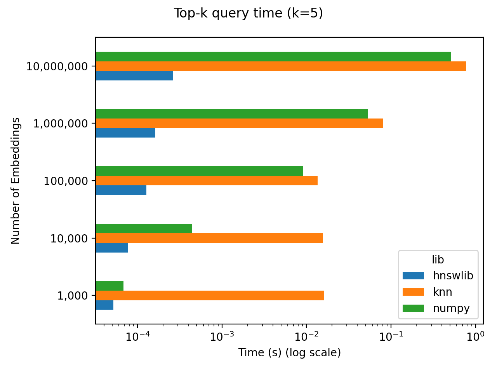

# nn-vs-ann

Nearest Neighbors vs Approximate Nearest Neighbors

This repo runs a quick benchmark for calculating nearest neighbors for embeddings / representations / vectors / latent factors / whatever you want to call them now. This benchmark pits an exact nearest neighbors calculation using [numpy](https://numpy.org/) against an approximate nearest neighbors calculation using [hnswlib](https://github.com/nmslib/hnswlib). The main takeaway is that exact nearest neighbors calculations scale poorly, but it depends on what scale you need. For a million documents and 256-dimensional embeddings, the top 5 nearest neighbor embeddings can be found in ~50 ms.

## Benchmark

Time in seconds.

| num_embeddings   |     hnswlib |       knn |       numpy |
|:-----------------|------------:|----------:|------------:|
| 1,000            | 5.16033e-05 | 0.0160115 | 6.79398e-05 |
| 10,000           | 7.74956e-05 | 0.0156339 | 0.000436649 |
| 100,000          | 0.000126944 | 0.0135723 | 0.00918114  |
| 1,000,000        | 0.000162601 | 0.081327  | 0.0532641   |
| 10,000,000       | 0.00026412  | 0.76874   | 0.517204    |



System Details:

- Intel Core i7-7820X 3.6 GHz 8-core Processor (16 virtual cores, I think)
- 32 GB DDR4-3200 RAM.
- Ubuntu 22.04

## Usage 

To run the benchmarks locally, clone this repo and then use [poetry](https://python-poetry.org/docs/) to install this package by running the following command in the root directory of this repo.

```commandline
poetry install 
```

Run the benchmarks by running 

```commandline
python -m nn_vs_ann.benchmark
```

This will save a file to `/assets/results.csv`. You can generate the plot in this README by running 


```commandline
python -m nn_vs_ann.viz
```

This will save a plot to `/assets/results.png`. 

Lastly, you can update this here README with your benchmark results by running

```commandline
python -m nn_vs_ann.gen
```
